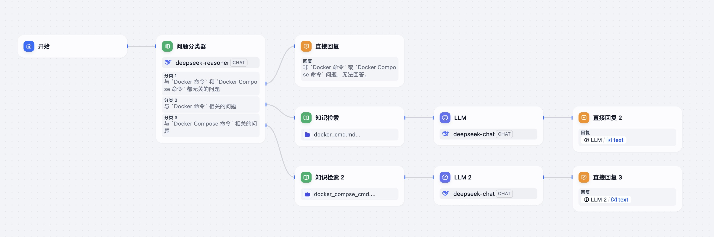
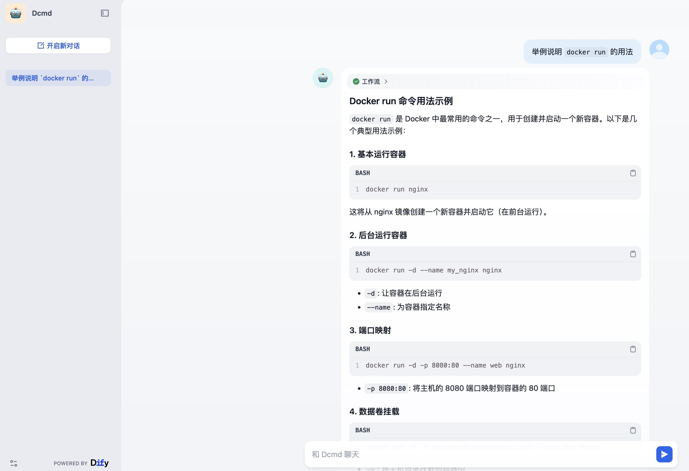
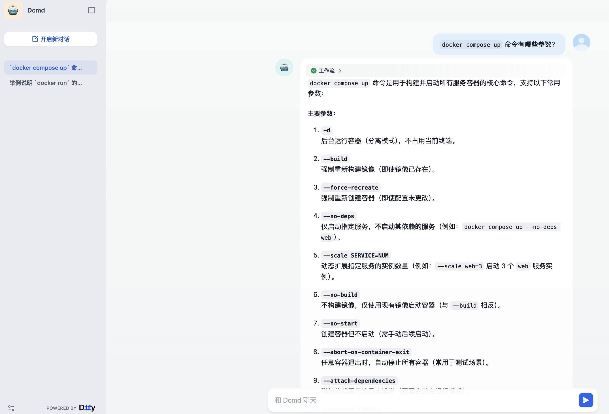

# 第七章作业 2

上传新的知识文档，搭建你自定义领域的智能客服机器人，发布并提交 1 个问题，查看结果。

## 准备 `docker`、`docker compose` 命令参考知识库

1. [docker 命令参考](docker_cmd.md)
2. [docker compose 命令参考](docker_compose_cmd.md)

## 构建应用、发布并提问

按照作业 1 中的步骤构建一个 `docker`、`docker compose` 命令参考助手 **Dcmd**

## 提问

