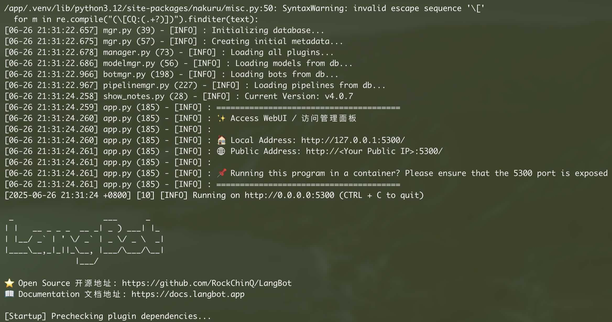
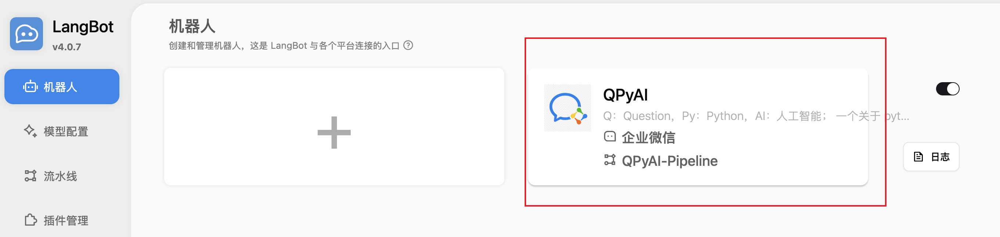
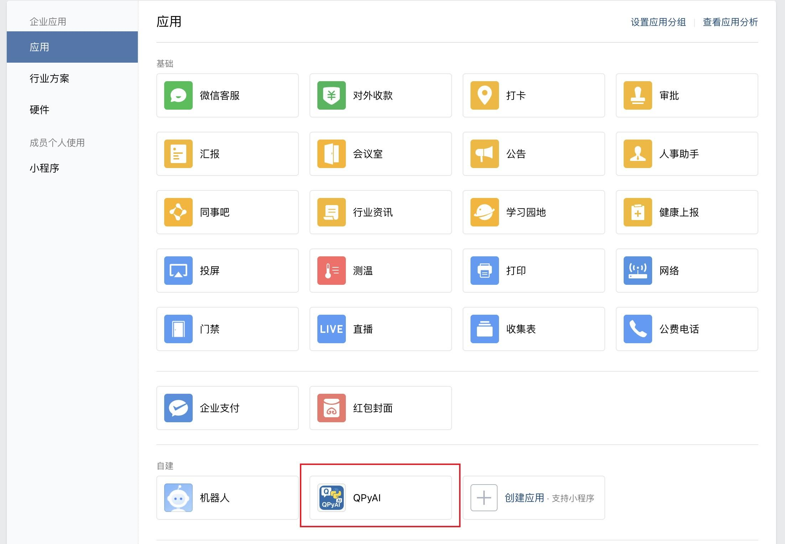
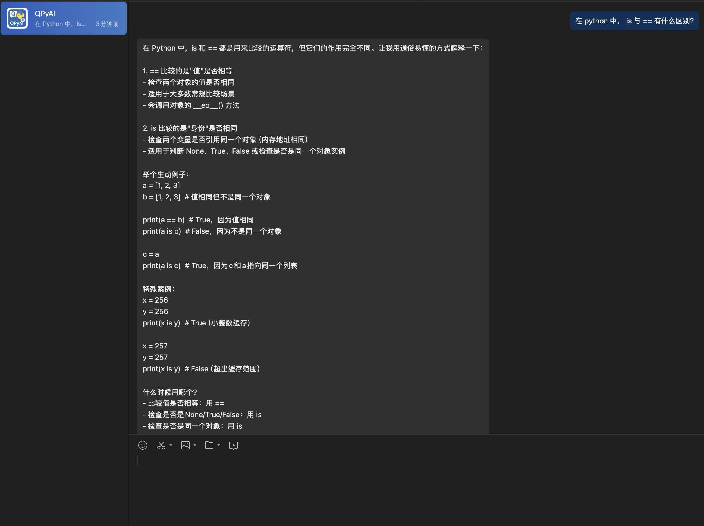
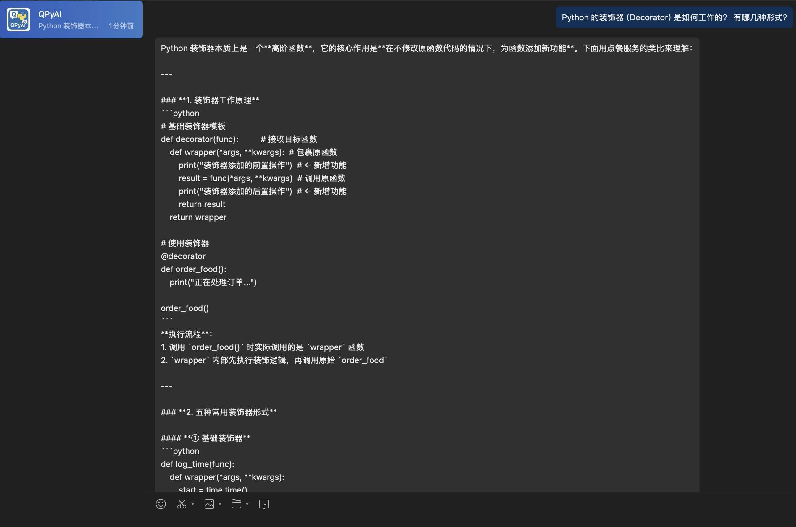
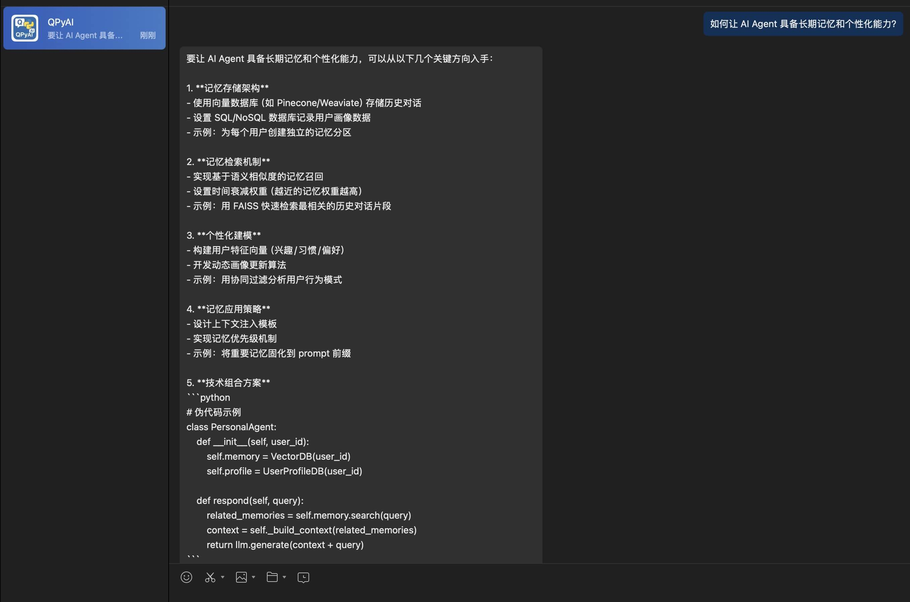
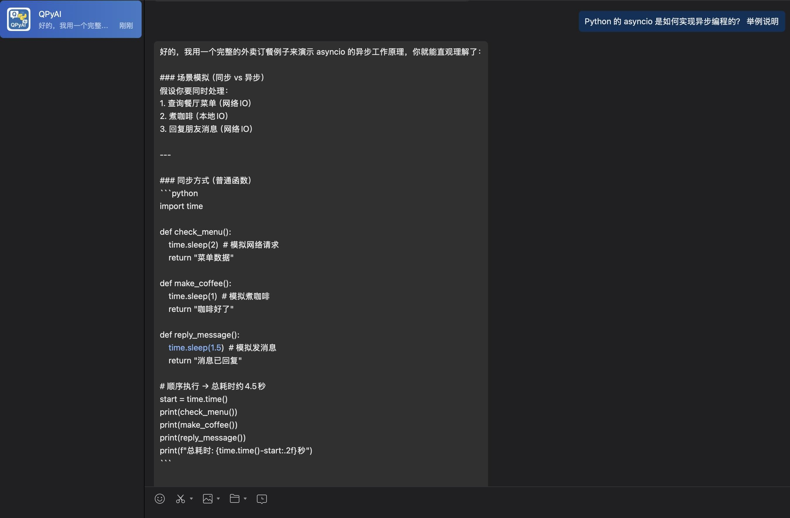
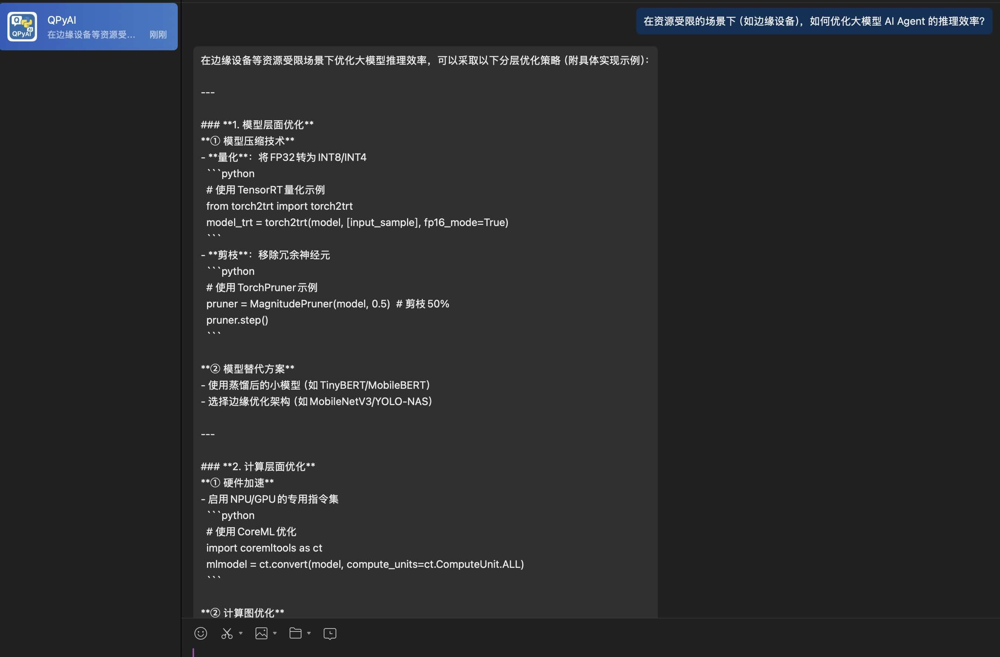

# 第八章作业

## 作业1

按照本节课的指导方法， 使用 Docker Compose 一键部署 LangBot 服务组件，并通过 docker-compose logs -f 指令查看 langbot 容器日志

## 作业 2

设计并创建一个企业微信应用，完成 LangBot 企业微信接入（包括机器人、模型和流水线配置），使用你的企业微信（或个人微信）与机器人完成至少 5 轮对话

### 创建应用 **QPyAI**
>
> Q：Question，Py：Python，AI：人工智能； 一个关于 python + ai、agent 技术相关的问答应用

### 应用对话

