# 第九章作业

## 作业1

按照本章的指导方法，完成 Dify 和 LangBot 的技术结合实践，创建企业微信应用（不限于雪茄百科，但必须是带有知识库的 RAG）。

### 1. 将上节课中 Dify 平台构建的 Dcmd 应用适配到 langbot 平台

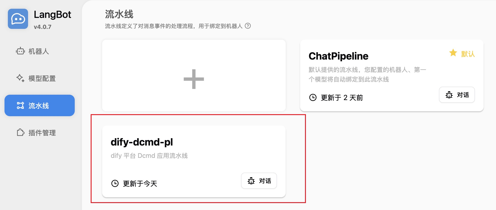
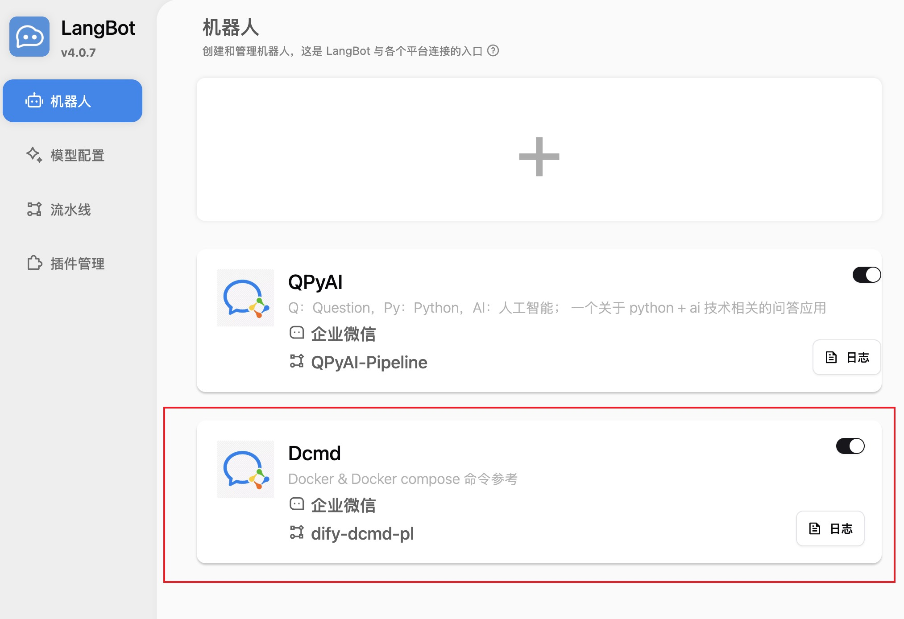

### 2. 企业微信创建 Dcmd 应用，并发起聊天

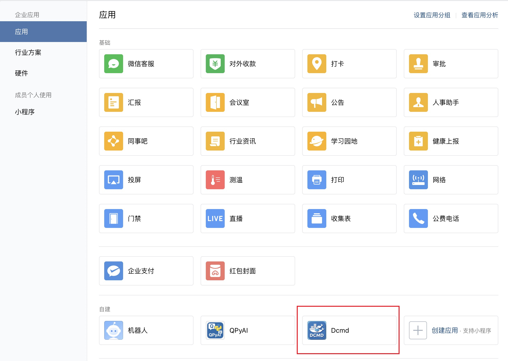
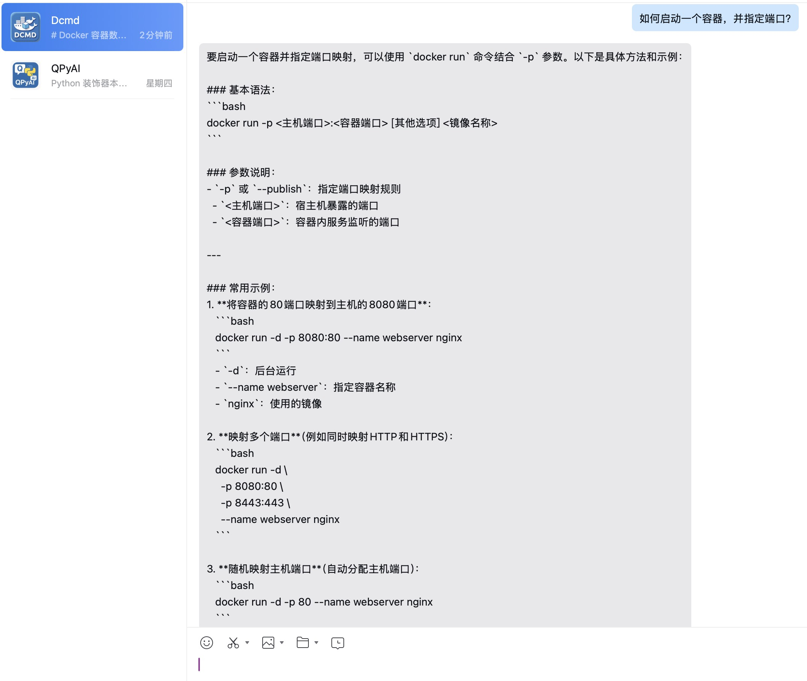
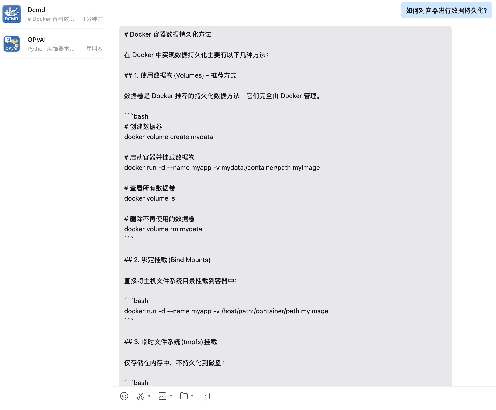

### 3. 查看 Dify 平台的日志

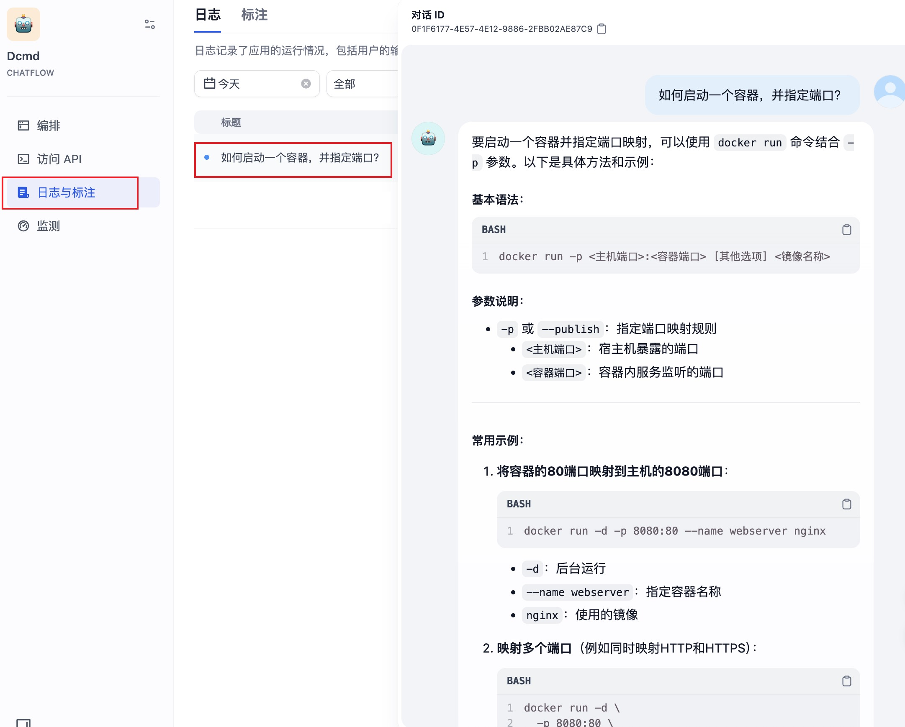

## 作业2

在飞书开发者平台，扩展课程中的简单对话应用，实现带有知识库的 RAG 智能客服（不限于高考志愿填报）。

### 1. 在 dify 平台创建知识库（[菜谱](菜谱.md)）和应用

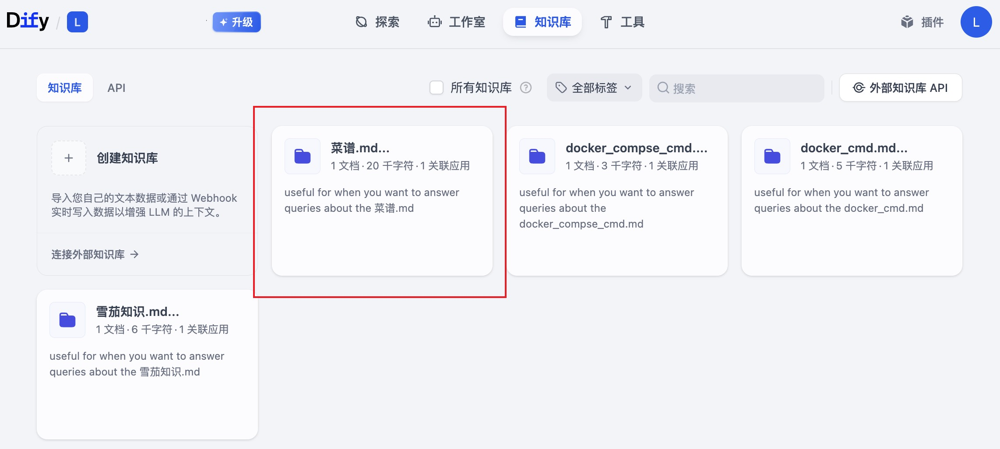
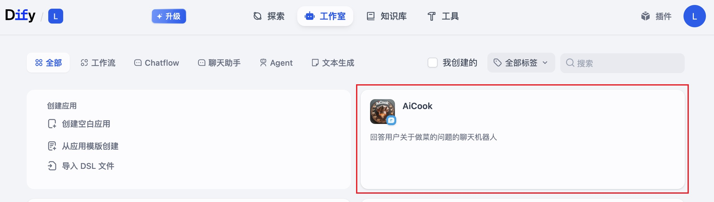

### 2. 在 langbot 平台创建流水线和机器人

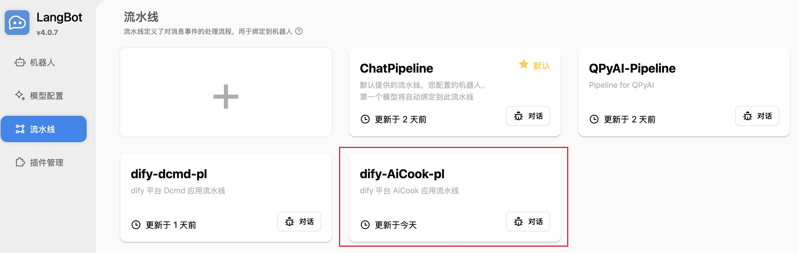
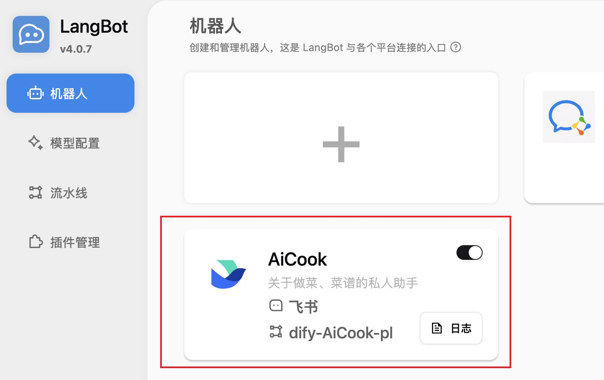

### 3. 在飞书开发者平台创建应用并发起聊天

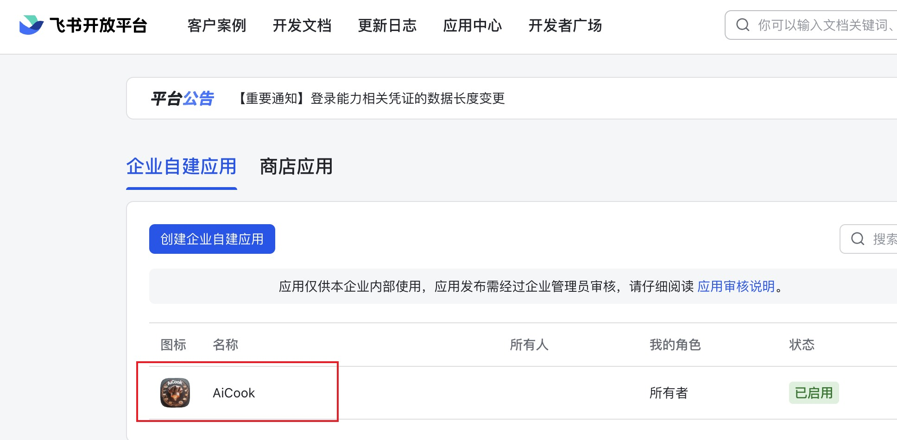
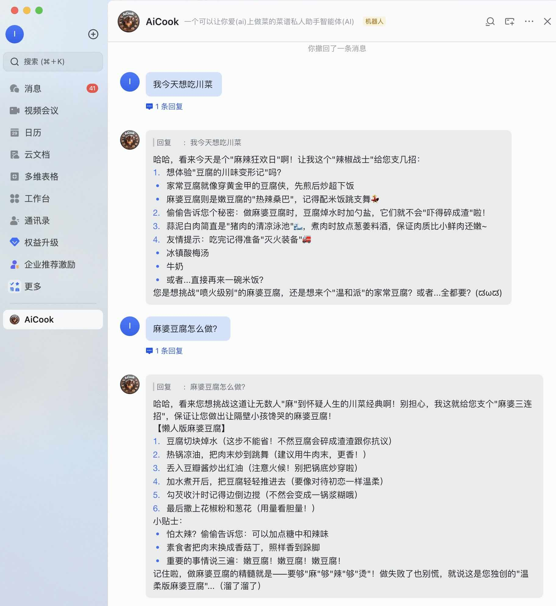

### 4. 查看 dify 平台的日志

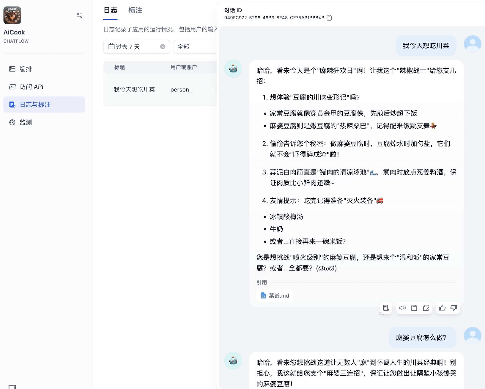
