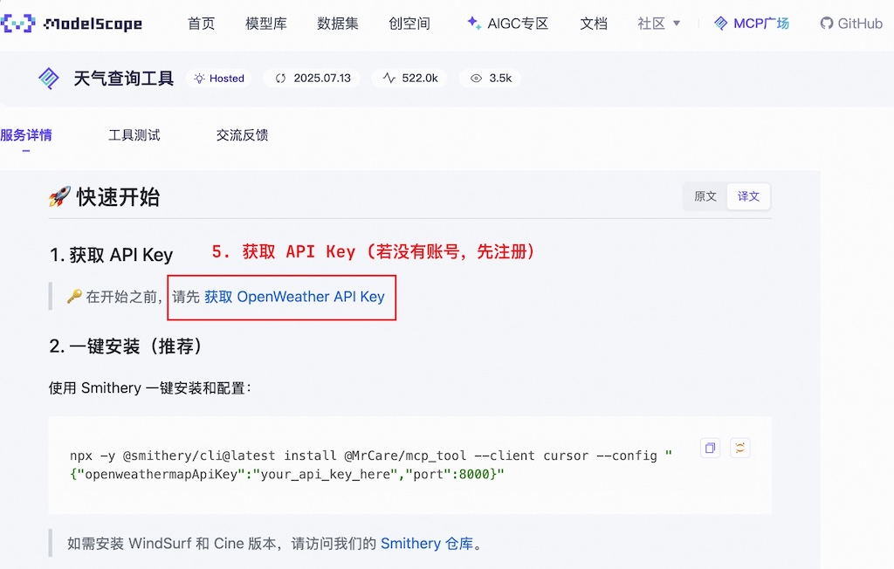

# 第十二章作业

## 作业1

成功搭建 VS Code + CLINE 的 MCP 开发环境 ，并基于课程项目提供的 weather.py 文件，完成美国天气助手应用。

### 1. 配置 CLINE

### 2. 验证 nws-mcp server

## 作业2

参考本章指导方法，在 CLINE 成功配置 12306 和中国天气查询 MCP Servers，完成行程规划助手应用。
> mcp 服务来自 [ModelScope MCP 广场](https://modelscope.cn/mcp)

### 1. 配置 12306-mcp server

### 2. 配置天气查询 MCP server

### 3. 行程规划助手应用对话

