# 第十六章作业

## 作业1

使用 FastGPT 开发 AI 行政助理 Pro，并完成课程中设计的全部功能，提交邮件发送成功和 FastGPT 工作流的截图。
> 知识库文档：[公司手册-v2](docs/公司手册-v2.md)
> 代码脚本：[markdown_to_email_format](scripts/markdown_to_email_format.js)

### 行政助理 Pro 工作流

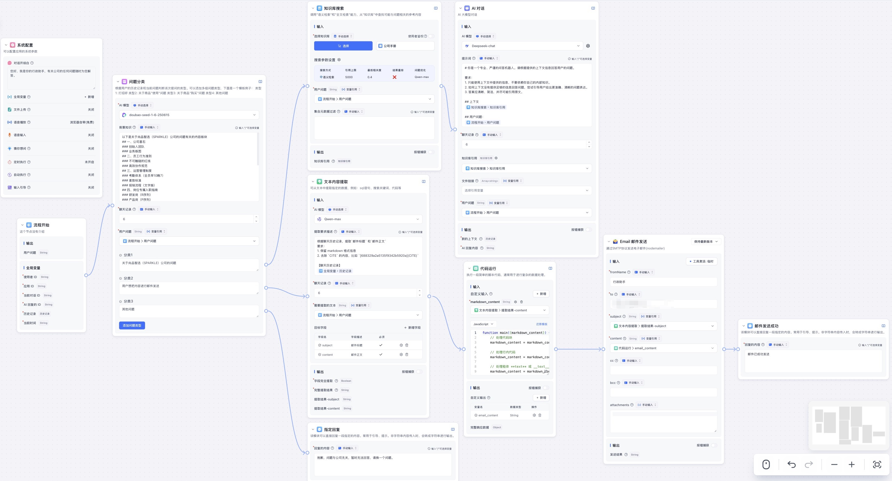

### 聊天并发送邮件

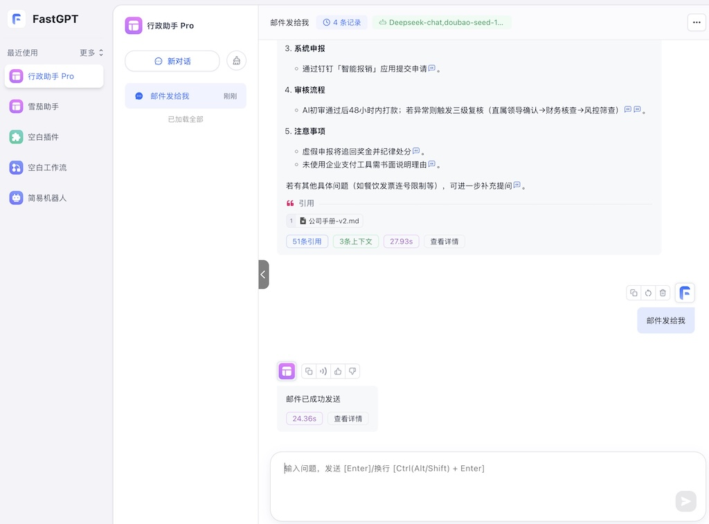
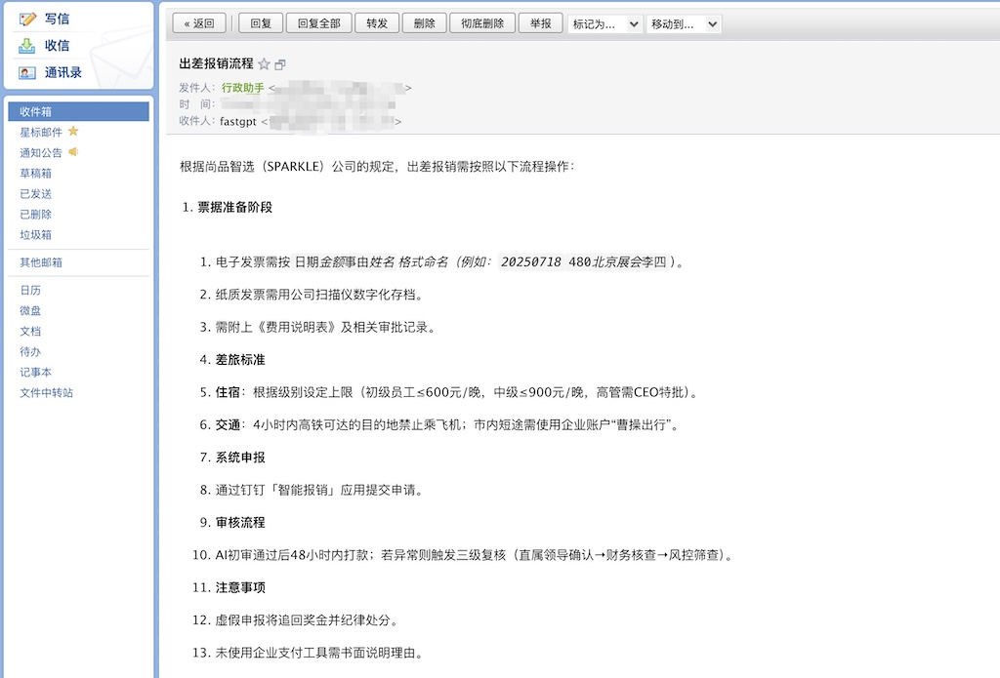

## 作业2

使用 FastGPT 开发 电商专业客服 RAG，并完成课程中设计的全部功能，以及 PostgreSQL 部署与数据库表创建。

提交至少 2 条售前和售后的咨询对话截图。
> 知识库文档：[产品售后](docs/产品售后.md)，[销售咨询](docs/销售咨询.md)
> 数据库脚本：[create](scripts/create.sql)

### 部署 PostgreSQL 并初始化数据库表及数据

#### 1.使用 docker 进行部署

```sh
sudo docker run -d \
--name postgres-v17 \
-p 5432:5432 \
-e POSTGRES_PASSWORD="替换自己的密码" \
-e PGDATA=/var/lib/postgresql/data/pgdata \
-v /data:/var/lib/postgresql/data \
postgres:17.5-alpine3.22
```

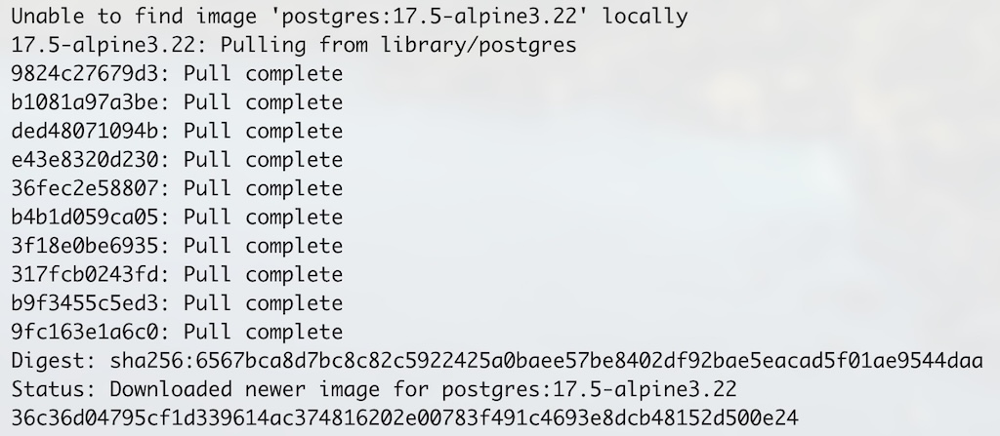

查看启动状态: `sudo docker ps`

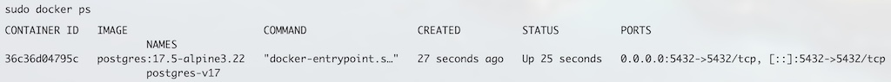

#### 2. 使用工具连接数据库并执行脚本 [create](scripts/create.sql)

### 电商专业客服工作流

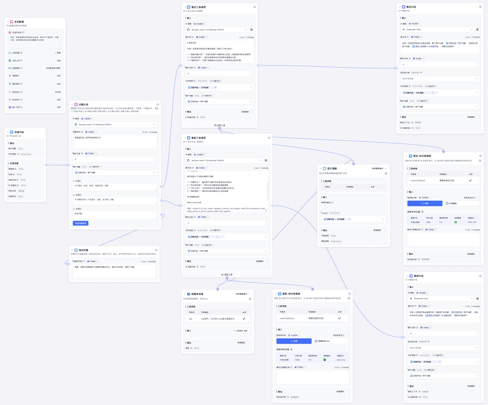

### 商专业客服-发起聊天

#### 售后聊天


#### 售前聊天


## 作业3

将 AI 行政助理 Pro 接入飞书机器人，并提交你与飞书应用的对话截图。

### 接入飞书应用

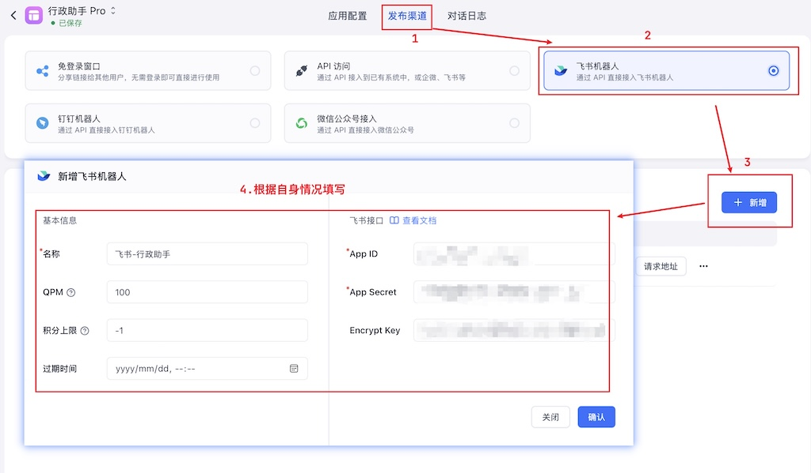
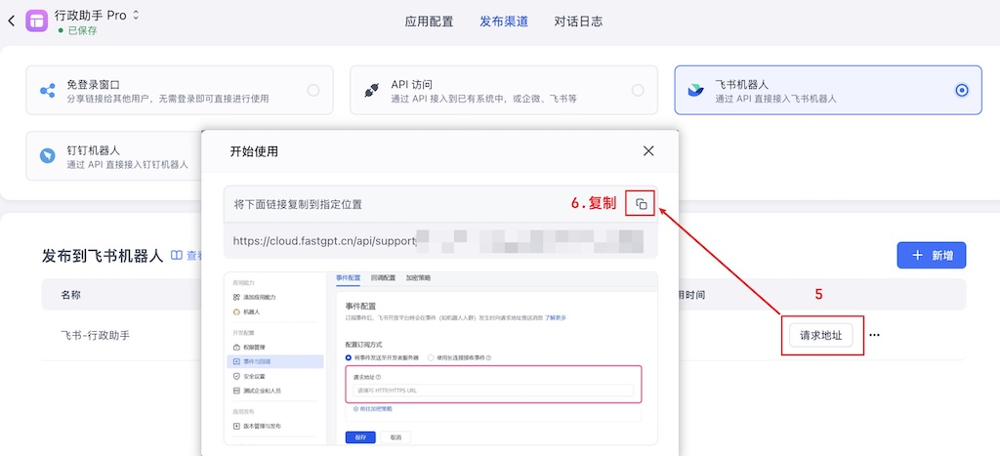
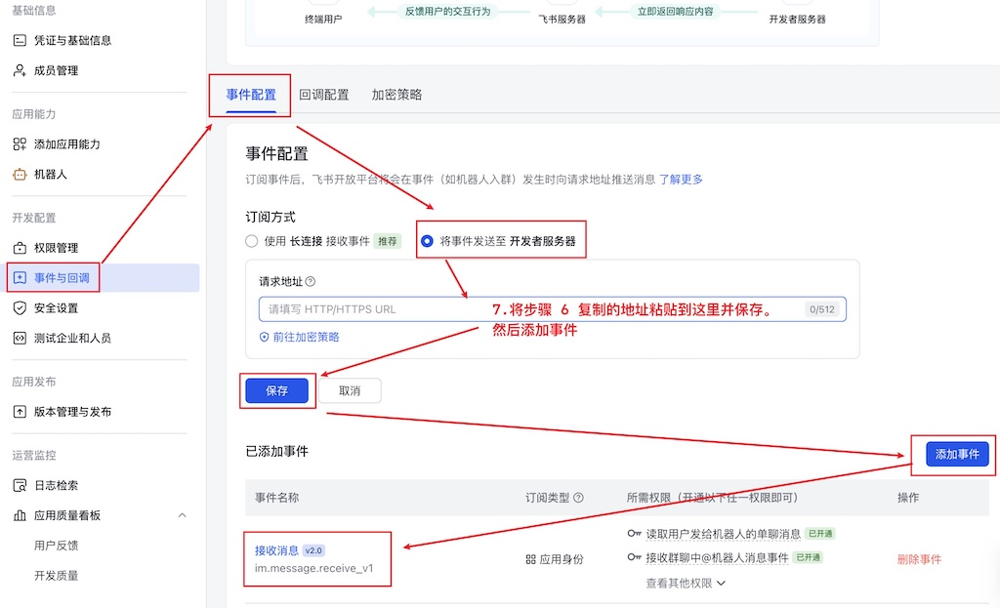

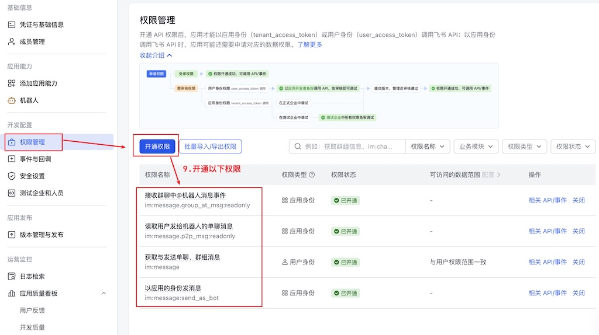
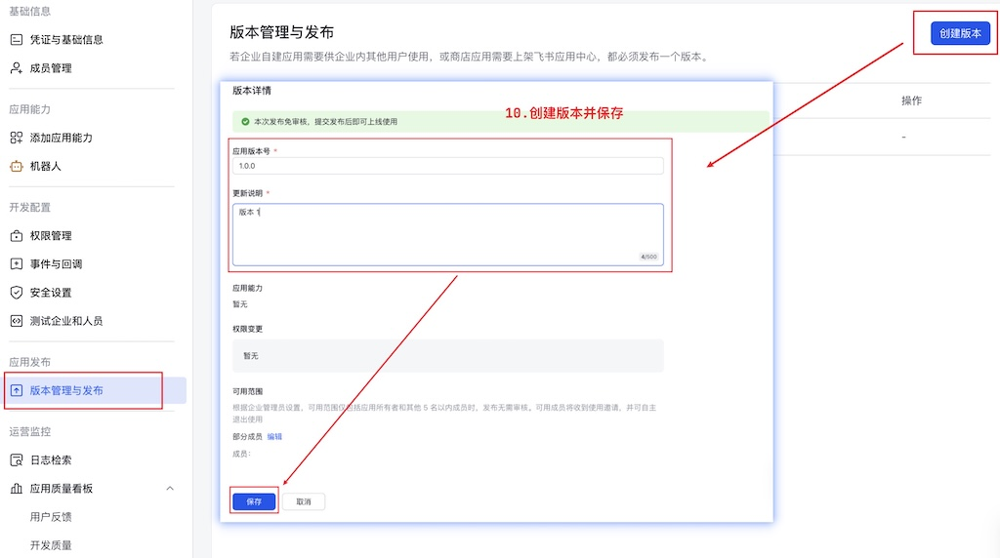

### 与飞书应用对话

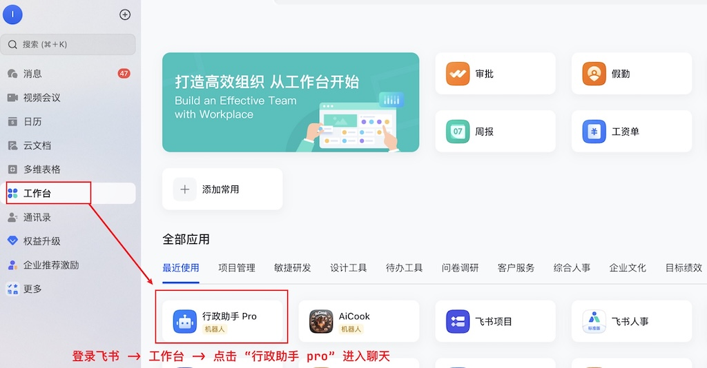
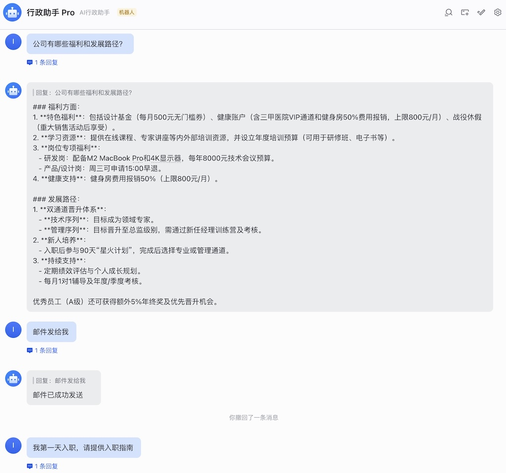
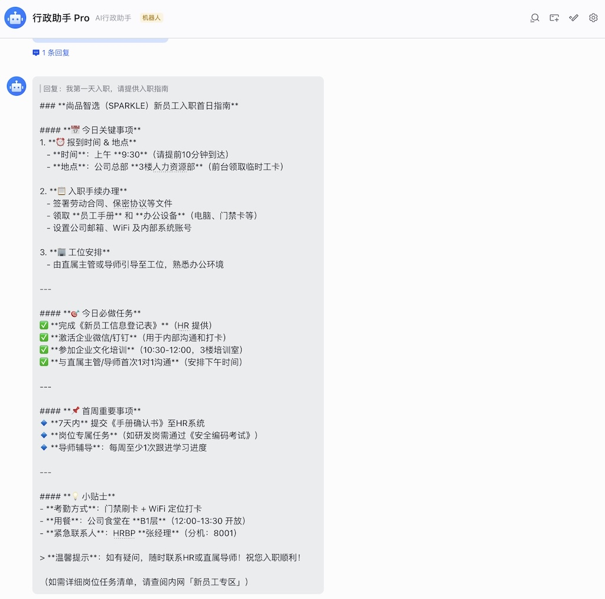
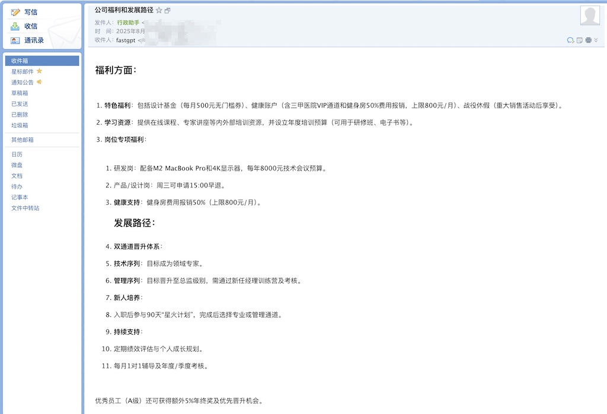
